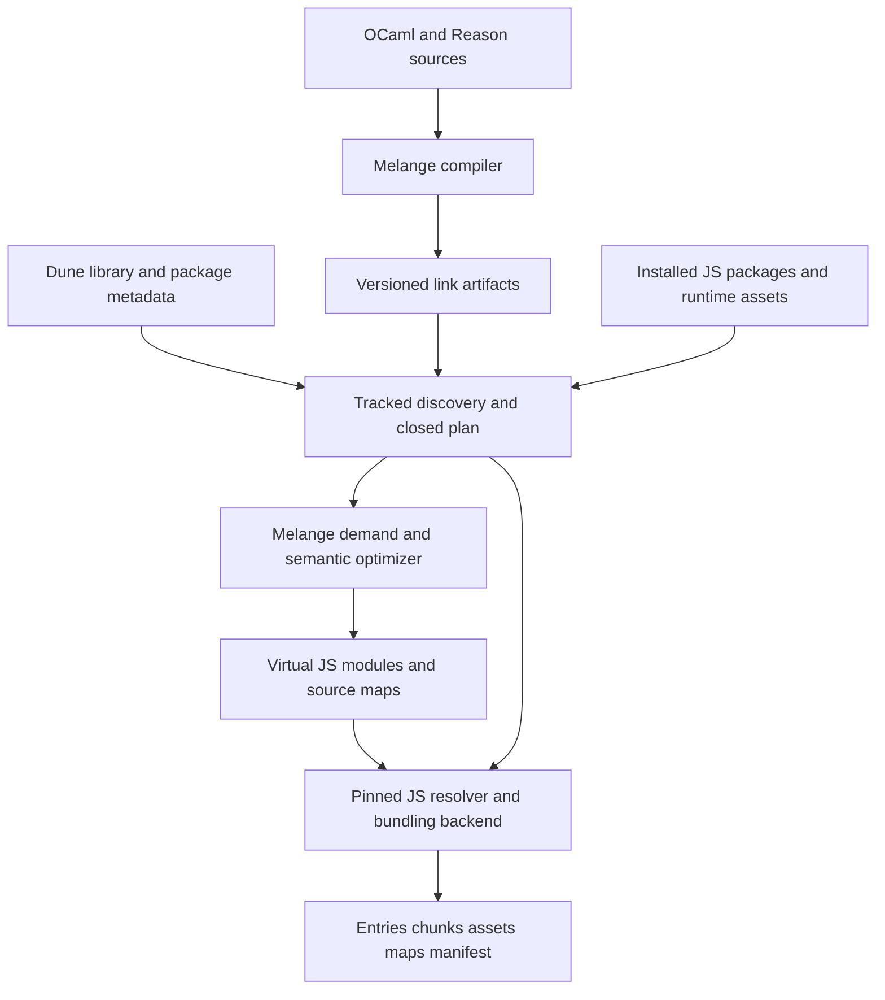

# Melange Optimizing Linker and Bundler Implementation Design

This document specifies a compiler-aware application linker for Melange, including JavaScript package resolution, bundled npm dependencies, Dune integration, incremental builds, and the tests required to ship it. It is intended for an implementor working across Melange and Dune. All new commands, artifact formats, modules, and stanza fields below are proposals, not existing interfaces.

The main opportunity for Ahrefs is to shorten the local edit-to-browser cycle in a large Melange codebase while enabling optimizations that need both compiler semantics and application entry points. The design moves cross-module optimization into a separately cached link stage, preserves more compiler IR, and integrates the resulting code with a mature JavaScript backend. Ordinary JavaScript tree shaking alone does not deliver those benefits.

The existing Ahrefs bundling setup is assumed to involve several tools; no application checkout, rebuild measurements, or complete integration requirements were available for this design. Performance improvements are hypotheses to measure. This is an implementation specification, not a report of an implemented or benchmarked system.

## 1 Decisions and delivery scope

The design makes these choices:

1. Build an OCaml executable, `melange-link`, and a reusable linker library alongside the Melange compiler. Preserve existing `melc` and `melange.emit` behavior.
2. Start with existing `.cmj` JavaScript IR as a compatibility input. Add a versioned `.cmjl` artifact containing complete, canonicalized Melange Lambda IR for semantic optimization. Existing `.cmj` summaries are insufficient for the full design.
3. Keep Melange module evaluation boundaries in the initial implementation. Optimize values and calls across units without inventing a replacement implementation of JavaScript module evaluation.
4. Use a pinned general JavaScript backend behind a versioned helper protocol. The reference backend is Rollup with pinned resolver and CommonJS adapters, qualified by the tests below. Melange must own semantic linking and optimization, but the proposed compiler-aware wins do not require it to implement arbitrary JavaScript parsing and bundling. This follows the preference to reuse a backend when that division is sufficient. A native backend can replace the adapter later without changing compiler artifacts.
5. Emit virtual JavaScript modules into that backend initially. This incurs JS printing and parsing at the bridge; eliminating those operations is not a first-release claim.
6. Have Dune build a closed input plan before the final bundle action. Start with a conservatively tracked package snapshot, then add selective positive and negative resolution dependencies.
7. Offer `development`, `production`, and `bridge` output modes. Development favors bounded optimization and reuse; production enables specialization; bridge emits optimized modules for an existing downstream bundler.
8. Keep JavaScript interop representations unchanged. Do not unbox public values, mangle foreign property names, or reinterpret historical CommonJS FFI defaults.

The first useful milestone bundles an application and its external JavaScript dependencies correctly. The next establishes application-rooted elimination. The ambitious result adds full-IR specialization and reduces implementation-driven recompilation cascades. These are separate gates: a functional bundler does not prove that local rebuilds are faster.

The compiler retains its information until its semantic optimization is complete; the JS backend receives already optimized modules plus explicit import, effect-boundary, source-map, and entry contracts. A native bundler becomes justified if profiling shows that the text bridge or backend invalidation dominates local rebuilds, or if a demonstrated optimization requires bidirectional IR coordination that the adapter cannot express. Replacing the backend should satisfy those measured needs and pass the same conformance suite, rather than being a prerequisite assumed from the word “integrated.”

The first release supports installed `node_modules` trees, nested and scoped packages, workspace symlinks, pnpm installations, static ESM and CommonJS imports, explicit dynamic imports, JSON, and configured assets. CSS, workers, and asynchronous chunking have dedicated qualification gates. Yarn PnP, arbitrary executable bundler plugins, network imports, runtime package installation, and a general-purpose OCaml representation optimizer are outside the initial profile.

## 2 Current implementation and boundaries

The source baseline is Melange commit `e8f5c2da40960ec0d282edcb7ee37d8584637333` and Dune commit `8cf80a16033c17158b8ada219b6b928504362830`. Paths and line anchors refer to these checkouts. Source facts in this section describe current code; the rest specifies proposed behavior unless stated otherwise.

| Current implementation | Consequence for this design |
| --- | --- |
| `.cmj` contains export arities, selected closed Lambda bodies, call summaries, a purity flag, package information, and `J.deps_program`. See [js_cmj_format.ml](../jscomp/core/js_cmj_format.ml). | It is a useful compatibility input, but not complete typed source or complete Lambda IR. |
| Full implementations pass through typing, OCaml Lambda, Melange Lam, and the J IR. See [js_implementation.cppo.ml](../jscomp/core/js_implementation.cppo.ml) and [lam_compile_main.cppo.ml](../jscomp/core/lam_compile_main.cppo.ml). | Preserve semantic input before unit-specific cross-module inlining and JS lowering. |
| [js_shake.ml](../jscomp/core/js_shake.ml) roots a unit's exports. | A final application can use a smaller root set, subject to initialization and foreign observation. |
| [lam_stats_export.ml](../jscomp/core/lam_stats_export.ml) exports only selected safe, relocatable bodies. Existing call summaries classify direct primitive/external calls. | New complete bodies and explicit effect/escape analyses are required. |
| Relative external calls are intentionally restricted from relocation in [lam_compile_env.ml](../jscomp/core/lam_compile_env.ml). | Every imported foreign reference must preserve its originating resolution context. |
| [j.ml](../jscomp/core/j.ml) represents compiler-generated JavaScript with assumptions about scopes and accesses. | It must not become an unverified AST for arbitrary npm JavaScript. |
| Current CMJ encoding uses a digest prefix and OCaml Marshal without a robust versioned envelope. | New link artifacts require validated lengths, checksums, schema and toolchain identity. |
| Dune's [module_compilation.ml](/Users/anmonteiro/projects/dune/src/dune_rules/module_compilation.ml:67) makes Melange consumers depend on implementation artifacts as well as interfaces. | An unchanged `.mli` does not currently guarantee that downstream compilation is avoided. |
| Dune's [melange_rules.ml](/Users/anmonteiro/projects/dune/src/dune_rules/melange/melange_rules.ml:416) emits JavaScript per unit and output format. | A bundle rule should consume artifacts directly instead of requiring that emission pass. |
| Dune already has watch/RPC build forwarding; dynamic actions currently cannot use its shared cache. | A persistent linker is additional compiler state, and discovery must be separated from a static final action. |

Some target wins can also be obtained by improving existing cross-module optimization. The project's distinctive value is the combination of final application demand, richer compiler facts, stable interop boundaries, and incremental link planning.

## 3 Architecture and ownership



The OCaml linker owns compilation-unit identities, artifact verification, application roots, Melange effects and escapes, specialization, optimization dependency tracking, and compiler-to-JS source maps. The JS helper owns arbitrary JavaScript parsing, package algorithms, CommonJS transformation, final JS module linkage, and chunk emission. Dune owns input production, scheduling, dependency facts, sandbox staging, action caching, and publication of output targets.

Do not run separate competing resolvers for the same edge. The helper's resolver adapter is the authority for foreign imports. It exposes decisions and filesystem observations to the plan builder. Internal `melange-unit:` identifiers bypass npm resolution entirely.

One build executes the following logical steps:

1. Resolve Dune libraries and selected virtual implementations; construct the unit catalogue.
2. Build any generated inputs; capture the relevant JS installation state.
3. Load artifact summaries and collect all potential foreign edges from reachable compilation units, including private definitions. Include the entire matching Melange runtime catalogue and declared tool-helper namespaces, since lowering can introduce imports absent from source FFI edges. Discover the conservative mixed module graph without first deleting code, using the same dependency-producing JS transforms as final emission.
4. Determine JavaScript consumers of Melange exports. Initially, any foreign import of a Melange namespace roots all its public fields; named-import precision is an optional later refinement.
5. Write an immutable plan containing the closed graph, input digests, resolution profile, origins, and root policy.
6. Dune declares the plan and its inputs for an ordinary static action.
7. The linker verifies and decodes units, computes demand, performs enabled semantic transformations, and lowers optimized units to virtual JS.
8. The helper bundles these units and foreign modules using only the plan's allowed inputs. Removed edges need not be emitted; new edges outside the conservative plan cause a plan error and rediscovery.
9. Validate the output graph and maps, write a manifest, and publish the complete output tree only on success.

Discovery may conservatively read or resolve a dependency later eliminated by optimization. A missing static import is therefore an error even if a future optimization might remove it. This gives a stable validation contract and avoids hiding broken package declarations behind optimization heuristics.

## 4 Profiles and compatibility contract

Keep four choices independent: target platform, source import semantics, optimization level, and output format.

| Choice | Initial values and contract |
| --- | --- |
| Platform | `browser` or `node`; determines builtins, conditions, and deployment constraints. |
| Melange source semantics | `esm` or `commonjs_compat`; inherited explicitly from migration configuration, never inferred from final output. |
| Optimization | `none`, `development`, `production`; same observable behavior, different budgets. |
| Output | `esm`, `commonjs`, or `bridge`; async chunks initially require ESM. |
| Resolution | Versioned `browser_bundle_v1` and `node_bundle_v1` profiles. These are bundler contracts, not a claim to implement native Node ESM lookup in every detail. |
| Foreign optimization | `conservative` by default; optional `package_contracts` may trust declared side-effect metadata and annotations. |

For example, a historical CommonJS FFI default is emitted today as `require(specifier).default`. It must remain that operation when the final application output is ESM. A static ESM default import is a different binding operation, and package `exports` can choose a different file for `require` and `import`.

The migration oracle is existing Melange output in the selected source mode processed by the same qualified JS backend. Also run native Node/browser ESM and CJS oracles for applicable fixtures: comparing two pipelines through the same backend alone would conceal shared backend bugs.

`bridge` mode writes optimized per-module JS, maps, an FFI-resolution manifest, and public entry facades for downstream tools. It does not claim that a downstream bundler will reproduce this design's resolution or optimization choices. Provide explicit adapters that consume the manifest; ordinary module output remains available when the downstream tool is not integrated. A downstream tool owns final chunks, CSS loading, and development-server HMR in that arrangement.

## 5 Stable identities and compiler artifacts

### Separate identity from version

Use logical identities independent of absolute checkout, sandbox, and output paths:

```ocaml
type unit_id = {
  library_instance : Library_instance_id.t;
  compilation_unit : string;
  runtime_abi : string;
}

type symbol_id = {
  owner : unit_id;
  export_path : string list;
}

type symbol_ref =
  | Public of symbol_id
  | Private of {
      owner : unit_id;
      owner_semantic_digest : Digest.t;
      local_ordinal : int;
    }

type artifact_version = {
  interface_digest : Digest.t;
  semantic_digest : Digest.t;
  imports_digest : Digest.t;
  origins_digest : Digest.t;
}
```

Dune assigns library instances using its resolved library graph and installation provenance. Two libraries with a `Utils` module remain distinct. A virtual unit maps to exactly one concrete implementation before linking. Private installed helpers are in the catalogue even when absent from the public module list.

A JS module identity includes its effective package instance, path within that instance, virtual-loader namespace, meaningful URL suffix/import attributes, and transformation profile. Do not deduplicate packages by name/version or file bytes. Two identical copies can have separate mutable state or different peer dependencies.

Compiler `Ident` stamps are local implementation details. Encode local binders as deterministic ordinals within a unit. Private ordinal stability across edits is not required initially; invalidate the containing unit when ordinals change, and never reuse a private reference under a different owner semantic digest. Public identities can remain stable across such changes. Content digests are versions of identities, not identities themselves.

On disk, encode owner-local ordinals in the canonical body and attach the validated owner semantic digest after decoding. Do not recursively embed a body's own digest into the bytes from which that digest is computed.

### Artifact levels

Support two inputs:

- **Compatibility object:** namespaced `J.deps_program` and existing metadata decoded from a matching current `.cmj`. It supports root selection and conservative J-level elimination. Legacy objects must match the compiler build that produced them; do not treat arbitrary Marshal input as portable.
- **Semantic object:** new `.cmjl`, containing complete prepared Lam, ordered initialization, explicit imports, export layout, ABI facts, and origins. It enables specialization before JS lowering.

A semantic object need not contain fallback J. A `linkable-only` compiler invocation must eventually produce `.cmi`, optional `.cmt`, and `.cmjl` without reading imported `.cmj` implementation summaries. It can lower generic calls at link time. A dual-output invocation may additionally emit legacy `.cmj` for existing consumers, with legacy dependency rules. Keeping these modes distinct avoids claiming cascade elimination while quietly retaining the old body dependencies.

Make artifact choice a library property, proposed as `(melange.artifacts legacy)`, `(melange.artifacts semantic)`, or `(melange.artifacts dual)` under the new extension. Default to `legacy`. `semantic` selects linkable-only compilation; `dual` emits both artifacts with the union of required dependencies and therefore retains legacy compilation cascades. A bundle cannot silently change flags for a shared library. Initially reject an `emit` or legacy compiler consumer requiring `.cmj` from a semantic-only library with guidance to select dual mode. A later separate `.cmjl`-to-`.cmj` lowering rule can improve this interoperation.

Each `.cmi` and `.cmt` has exactly one producing rule, respecting the existing separate `.mli` compiler rule. Dual mode uses one implementation action for its outputs, not two conflicting front-end actions. Two bundles share the same semantic artifacts. Selecting semantic mode for a closure must validate that every compiling consumer's artifact requirements are satisfiable.

Use an explicitly encoded, deterministic format for `.cmjl`. An exact-build Marshal envelope is acceptable for an internal prototype, but is not the released installed-library format. Proposed layout:

```text
header:
  magic = MELCMJL\0
  schema_major, schema_minor, encoding_id
  compiler_build_id, compiler_libs_abi, runtime_abi
  required_feature_bits, section_count
  directory_checksum
section directory:
  tag, byte_offset, byte_length, uncompressed_limit, checksum
sections:
  identity_and_interfaces
  imports_and_export_layout
  canonical_lam
  initialization_groups
  semantic_facts
  source_origins
  optional_fallback_j
```

Use fixed-width little-endian integers for the envelope, bounded lengths, UTF-8 strings, explicit variant tags, and canonical ordering. Define the codec in `Link_artifact_codec`; avoid encoding OCaml constructor ordinals implicitly. Use SHA-256 content digests throughout the new wire/file formats. Include schema and policy IDs in digest domains.

The summary contains section digests and byte offsets so discovery need not load all bodies. Runtime layout, exported binding kind, calling convention, source module mode, imported `.cmi` digests, and referenced units are mandatory. Optimization-derived effects are recomputable hints tagged with their analysis version; incompatible hints are ignored, not trusted.

The decoder checks lengths before allocation, validates section checksums, rejects unknown mandatory features, verifies all indices and binders, and checks runtime/interface consistency. A truncated artifact or unsupported major version produces `E_ARTIFACT_INCOMPATIBLE` with the unit and a rebuild instruction. Never silently fall back from a corrupt semantic object to a different artifact.

### Import provenance

Each FFI edge records:

```ocaml
type foreign_edge = {
  edge_id : Edge_id.t;
  source_origin : Origin_id.t option;
  owner_unit : unit_id;
  semantic_importer : Logical_path.t;
  resolution_environment : Resolution_environment_id.t;
  raw_specifier : string;
  kind : [ `Import | `Dynamic_import | `Require | `Require_resolve ];
  binding : [ `Namespace | `Default | `Named of string
            | `Require_value | `Require_default_property | `Side_effect ];
  attributes : (string * string) list;
}
```

There are three separate paths: logical unit identity, semantic importer location, and physical staged input location. In compatibility mode, the semantic importer corresponds to the original per-unit emitted-JS topology and runtime-dependency layout, since existing FFI literals are emitted unchanged. It is not automatically the OCaml source directory, and is never the final bundle directory. Normalize that topology into the catalogue; do not make an incidental generated `node_modules` directory the authoritative package identity.

Relative runtime assets have explicit origin-to-materialization mappings. Bare dependencies of an installed OCaml library use an explicit policy: `application` environment by default for newly configured libraries, or a declared package-owned environment. Migration imports the old emission environment as configuration. Installation prefixes must not accidentally choose the policy. If an old package lacks enough provenance, require a user mapping or retain the old emission bridge; do not guess.

Inlining copies the edge identity, not just its string. Two identical `"./helper.js"` strings from different origins remain separate edges until resolution proves they identify the same module.

## 6 Compiler refactoring and separate compilation

Refactor `Lam_compile_main.compile` into explicit phases:

```ocaml
prepare_lambda : compile_context -> Lambda.lambda -> prepared_unit
optimize_unit : optimization_context -> prepared_unit -> optimized_unit
lower_unit : lowering_context -> optimized_unit -> J.deps_program
emit_unit : emission_context -> J.deps_program -> emitted_unit
```

Capture prepared Lam just after `Lam_convert.convert` and initial deep flattening, before current unit-specific cross-module inlining. Earlier OCaml Lambda simplification is part of the documented compiler boundary. Do not serialize a mutable compiler environment or infer that full source types survive to Lam. If an optimization needs a typed fact, record a small explicit fact at translation, together with its validity conditions.

The `prepared_unit` contains all private definitions and original initialization order. Initially keep its expression structure close to Lam. Add explicit import handles, canonical local IDs, and origin IDs through a conversion layer instead of trying to persist every internal mutable compiler data structure.

The capture writer must not mutate Lam/metadata or consume global identifier stamps used by legacy compilation. With identical flags, paths, and toolchain, legacy compilation with capture enabled versus disabled must preserve JS and CMJ bytes. This gate does not require bundled output to be byte-identical to standalone emission: canonicalize J structure and compare runtime behavior when import IDs, binding names, maps, or module layout necessarily change.

Implement `linkable-only` mode in this order:

1. Inventory reads of imported implementation data in Lam conversion and preparation.
2. Move optimization-only reads into the linker. Resolve imported unit identity and public layouts from `.cmi` plus the Dune catalogue.
3. Represent unknown imported call arity conservatively. Use existing generic calling conventions until link-time facts prove a direct call safe.
4. Keep ABI-required representation facts explicit and stable; never derive them from an optional optimized body.
5. Run compilation in a fixture where imported `.cmj` files are absent. It must succeed using interfaces and produce equivalent runtime behavior after linking.
6. Update Dune dependency rules only for the new mode. Existing compilation retains existing dependencies.

An implementation edit with unchanged interface should then rebuild the edited unit's semantic object and the affected link computations, rather than retype/recompile every source consumer. An inferred-interface edit can legitimately change `.cmi` and trigger downstream compilation. A body used for specialization can also legitimately invalidate link consumers. These are the precise boundaries of the rebuild-cascade claim.

### Relocation and validation

Before any cross-unit transformation:

1. Allocate fresh local IDs for all binders, including recursive groups before their bodies.
2. Rewrite parameters, let bindings, loop/catch variables, assignments, all uses, imported module references, and export sets.
3. Freshen static catch/raise labels within their scopes.
4. Recompute closure environments, identifier sets, and derived scope data; do not copy caches holding old identifiers.
5. Resolve symbolic internal imports through the catalogue and attach resolved foreign-edge handles.
6. Verify no dangling IDs, duplicate binders, invalid exits, or inconsistent interfaces.

Extend `Lam_check` for these invariants. `Lam_pass_alpha_conversion` is not a ready-made bundle-global renamer; its current purpose includes call-arity rewriting. Existing bounded-variable rewriting in beta reduction can inform the new relocator, but does not remove the need for whole-artifact validation.

## 7 Reachability and observable behavior

### Distinguish value demand from evaluation

Maintain separate demands for a definition's value and its module's evaluation. A live import can require initialization without using an exported value. An unused binding can still write state, throw, diverge, or register a callback.

Root policies are explicit:

- An application entry roots evaluation plus configured exported bindings, usually no public exports.
- A library entry roots its declared public surface and required evaluation.
- A foreign named import roots the binding and evaluation; v1 may conservatively root the complete public namespace.
- A namespace passed to unknown JS, enumerated, dynamically indexed, or otherwise escaped roots every observable member.
- A configured worker or static dynamic import creates a separate entry with its own timing boundary.

```text
enqueue entry evaluations and externally visible values
repeat until queue empty:
  pop unseen demand
  evaluation demand:
    retain required static-import evaluation edges
    retain ordered initialization with observable effects
  value demand:
    retain defining expression and referenced values
    retain owner evaluation prerequisites
  internal immutable module field:
    demand that field if escape and identity facts permit
  opaque module or namespace:
    demand every observable field
  dynamic edge:
    register async entry without making its evaluation eager
```

For v1, preserve per-unit import order as represented by baseline emitted modules, including current dependency ordering. Let the qualified JS backend implement ESM/CJS evaluation. Do not globally topologically sort statements or reorder initializer groups by name. A mixed cycle through foreign JS is possible even when the OCaml unit dependency graph is acyclic.

Compute synchronous module SCCs separately from dynamic edges. Dynamic imports create execution boundaries and do not become eager evaluation edges merely because a syntactic graph contains a cycle. Keep mixed foreign SCCs and asynchronous boundaries as barriers to initializer movement. Retain foreign modules as opaque effect and escape boundaries in the Melange optimizer. Final backend tree shaking is separately configured and qualified.

### Effects and escapes

Use a conservative effect summary with at least:

```ocaml
type effects = {
  reads_mutable : Region_set.t;
  writes_mutable : Region_set.t;
  allocates_identity : bool;
  may_throw : bool;
  may_diverge : bool;
  calls_unknown_js : bool;
  schedules_async : bool;
  observes_namespace : bool;
}
```

Pair it with argument escape, result escape, known call targets, and regions reachable from each value. Unknown calls start at the conservative top of the lattice. Solve call SCCs to a fixed point with widening. Recursion remains potentially divergent unless a specific analysis proves otherwise. A discarded result does not justify removing a call that can throw or loop forever.

Compute module-initialization summaries separately from function-call summaries. Initialize known functions from local primitive effects, propagate known-callee summaries over call SCCs until stable, and add top immediately for unknown callees. Mark recursive SCCs as potentially divergent unless proven otherwise. Cap region sets by widening to an unknown region rather than truncating them. Record the exact facts read by each result so edits can invalidate it.

Internal compiler-created records can have precise field semantics. Arbitrary JS property reads can invoke getters or proxies and must not use `Js_analyzer`'s assumptions about generated field accesses. FFI types do not prove foreign purity. Raw JS, unsafe casts, `Obj` operations, opaque identity barriers, and escaping callbacks reduce precision.

Treat physical identity as observable. Do not merge equal-looking allocations, duplicate an escaping function wrapper, hoist a mutable allocation across calls, or replace two functor instances with one. `sideEffects: false` describes a package's module-elimination contract; it does not prove that calling any export is pure.

### References to owner state

When inlining an exported function that reads a private module ref, preserve a reference to that once-initialized ref. An internal synthetic export/import is allowed only when that module's namespace shape is unobservable; otherwise adding an export would change `Object.keys` or namespace reflection. Initially skip the transformation in the observable case. A later private backing-module/public-facade split must preserve the exact public key set and pass cycle/evaluation tests. Alternatively keep the units in a proven-safe common region. Never clone the ref into each caller. Retain the owner's initialization dependency even if no ordinary exported function reference remains.

An optimizer may create specialized internal entry points while keeping one canonical externally visible wrapper. Calls through foreign JS, callback registration/removal, equality, and object keys must continue to observe the same wrapper identity and ABI.

## 8 Optimization algorithms and budgets

Implement passes in this order and record which facts each transformation consumed:

1. **Whole-application export elimination.** Propagate demand across symbolic imports; shrink internal export sets, retaining effects and escaping namespaces. Run current J shaking with the new roots for compatibility objects.
2. **Module-field projection folding.** Replace reads of known immutable module fields with symbol references. Preserve evaluation of the module expression and any unused effectful fields.
3. **Direct-call conversion.** Use known callee identity and calling convention to remove indirection or Curry helpers. Preserve currying, partial application, optional-argument conversion, and method receivers.
4. **Bounded cross-unit inlining.** Clone/freshen the body, preserve argument evaluation order and count, attach original import handles and owner-state references, then simplify. Reject transformations across unsupported barriers.
5. **Functor and higher-order specialization.** Specialize code for known module fields or closures, then repeat projection folding and direct calls.
6. **Scalar replacement.** Remove a functor-result/module object only when all uses are known field operations and neither identity nor namespace shape escapes. Keep required field initialization at its original point.
7. **Final demand and effect cleanup.** Recompute affected summaries, remove newly dead definitions, lower to J, and run existing local backend passes.

For functors, the initial specialization lookup key is `(callee body digest, abstract argument signature, ABI, policy)`. Validate every consumed fact/body digest before reusing a cached result, or include that complete read set in its final key. A stable known argument symbol alone is insufficient if its implementation changed. Abstract argument fields can be constants, known function symbols, known immutable fields, or unknown. Substitute only facts that are valid for that application. Cache specialized code, not the runtime result of applying a functor. Separate applications still allocate separate refs, exceptions, and identity-bearing values.

Initial deterministic policy defaults, subject to benchmark tuning:

| Policy | Development | Production |
| --- | --- | --- |
| Maximum variants per callee | 2 | 8 |
| Maximum specialization depth | 1 | 3 |
| Cross-unit inline body budget | 40 Lam nodes per call | 160 Lam nodes per call |
| Total cloned-node growth | 10 percent plus 2,000 nodes per entry region | 30 percent plus 10,000 nodes per entry region |
| Unknown/recursive specialization | Keep generic call | Keep generic call when budget or proof fails |

These numbers are proposed initial budgets, not performance findings. Count nodes with a documented traversal and process candidates in stable symbol order. Do not use elapsed time to choose transformations; that would make outputs depend on machine speed. Emit `--explain` records such as `specialization skipped: callback escapes` or `growth budget exhausted`.

The motivating structural targets are an unused functor result field disappearing, a known module-field call becoming direct, a wrapper/Curry call disappearing where arity is proven, and a private implementation edit avoiding source-consumer recompilation. Require runtime equivalence as well as structural assertions. Small output alone is not success.

## 9 JavaScript backend and interop

### Pin and qualify the reference backend

Use Rollup 4 and exact, locked revisions of `@rollup/plugin-node-resolve` and `@rollup/plugin-commonjs`. The first implementation commit selects concrete compatible versions, records integrity hashes in the JS lockfile and Nix inputs, and runs the qualification suite. Do not invent a version number in this design or use semver ranges as a build identity. Include the helper revision, Node runtime identity, platform-specific backend components, and all effective options in the toolchain digest.

Baseline configuration, expressed as proposed helper code:

```javascript
const inputOptions = {
  treeshake: false,
  preserveEntrySignatures: "strict",
  preserveSymlinks: false,
  shimMissingExports: false,
};

const outputOptions = {
  format: "es",
  sourcemap: true,
  inlineDynamicImports: false,
  hoistTransitiveImports: false,
  externalLiveBindings: true,
  freeze: true,
  validate: true,
};

const cjsOptions = {
  strictRequires: true,
  defaultIsModuleExports: true,
  requireReturnsDefault: "namespace",
  transformMixedEsModules: false,
  ignoreDynamicRequires: false,
  ignoreTryCatch: true,
  sourceMap: true,
};
```

The initial backend disables foreign-JS tree shaking and general minification. Melange's own validated elimination still runs. Rollup documents that inlining dynamic imports can execute formerly lazy modules immediately, so this design keeps separate async outputs instead. See [Rollup output options](https://rollupjs.org/configuration-options/#output-inlinedynamicimports).

`strictRequires` wraps CJS modules so execution can remain lazy. The adapter must still detect unsupported constructs. In particular, `ignoreDynamicRequires: false` can produce a runtime throwing helper; it is not a build-time rejection. Add an AST validation pass before CommonJS transformation, using Rollup's public `this.parse` plus a helper-owned lexical binding/scope walk, for uncontracted dynamic require, mixed ESM/require, optional external require, direct eval that depends on renamed lexical bindings, and `require.cache` manipulation. Rollup does not expose its internal scope graph as this public API. A user-defined function called `require` must not be misclassified. Decide whether to run CommonJS conversion from the plan's resolved format, not extension alone: a `type: module` file without import/export syntax still has ESM semantics. See the [CommonJS plugin's options](https://raw.githubusercontent.com/rollup/plugins/master/packages/commonjs/README.md).

For the initial Node profile, optional literal requires in try/catch and other runtime-external CJS requires require CJS output and an explicit deployed resolution environment. Preserve the call at its original position; do not let the backend hoist it into an ESM import. Reject this combination in ESM output initially. A later adapter may use `createRequire` bound to a deployment-contract origin and invoked at the original call site. `strictRequires` alone does not solve external require timing. Browser builds reject external CJS operations without a separately qualified runtime loader. Mixed ESM/CommonJS source is rejected initially unless a separately qualified transform profile is enabled. Dynamic loading with a finite declared map is supported through a generated dispatcher; arbitrary computed loading is not silently emitted as broken browser code. `require.resolve` initially produces `E_REQUIRE_RESOLVE_UNSUPPORTED` unless the explicit Node runtime-external contract preserves its path meaning; it is never replaced with a build-machine path.

Explicitly bypass CommonJS conversion for those runtime-external calls using its `ignore` mechanism or an equivalent adapter. When the same raw specifier is bundled in one origin and external in another, rewrite selected external edges to unique sentinels before conversion, ignore only those sentinels, then restore the deployed runtime specifiers in a source-map-aware AST pass. A global ignore rule by package name would incorrectly affect unrelated bundled edges.

All unresolved static imports are errors unless an explicit externalization rule applies. Rollup warnings that would implicitly externalize imports must become structured errors. Circular-dependency warnings are retained and attributed; a cycle itself is not automatically an error when the qualified profile supports its behavior.

### Virtual modules

Use three namespaces:

```text
melange-unit:<logical-unit-id>
melange-ffi:<edge-id>
melange-public:<public-facade-id>
```

The plugin maps `melange-unit:` to generated JS and a map. `melange-ffi:` reads the original edge record and resolves the raw specifier from its semantic importer. It never resolves from the unit into which the call was inlined. Foreign JS imports of public Melange modules resolve through explicit facade mappings and contribute roots during discovery.

The Rollup resolver bridge passes the original edge kind:

```javascript
const result = await this.resolve(edge.specifier, edge.semanticImporter, {
  skipSelf: true,
  custom: {
    "node-resolve": {
      isRequire: edge.kind === "require" || edge.kind === "require_resolve"
    }
  }
});
```

This is an adapter sketch, not sufficient implementation by itself: `semanticImporter` must map to the snapshot topology, the returned ID must become a canonical package-instance ID, and each plugin read must be confined to or accounted for by the closed input plan.

For `commonjs_compat`, emit whole generated Melange units as CommonJS, preserving original require positions and `.default` property access. Serve these virtual units under synthetic absolute paths within the snapshot namespace ending in `.cjs`, or explicitly configure and qualify equivalent plugin filters, so the CommonJS plugin actually transforms them. Use `strictRequires` and create ESM facades only at public entry boundaries. A per-edge thunk is an optional later implementation, invoked at the original evaluation point; importing an adapter whose top level performs `require` would make evaluation eager and is not equivalent. Assert that browser output contains no unintended runtime require. Cache canonical module instances independently from source edges.

Keep ordinary Melange-to-Melange calls under compiler conventions. Foreign namespace objects, named/default bindings, mutable live bindings, `this`, callable CJS exports, and `__esModule` are validated at the adapter boundary. No optimization may infer a JS exported function's purity from its OCaml external declaration.

### Later foreign optimization

After the baseline passes, introduce a separately versioned conservative tree-shaking profile:

```javascript
treeshake: {
  preset: "safest",
  annotations: false,
  correctVarValueBeforeDeclaration: true,
  moduleSideEffects: true,
  propertyReadSideEffects: "always",
  tryCatchDeoptimization: true,
  unknownGlobalSideEffects: true,
}
```

Override per-module `moduleSideEffects` values returned by resolution plugins unless the profile explicitly trusts package metadata. Global settings alone do not override every plugin decision. A separate opt-in profile can trust `sideEffects` and pure annotations, with package-specific exceptions. See [Rollup tree-shaking options](https://rollupjs.org/configuration-options/#treeshake).

Add minification and syntax lowering as pinned transformations only after their own semantic and source-map suite passes. The baseline targets syntax supported by the chosen browsers/Node version; it does not promise transpilation merely because a `target` field exists. Do not mangle arbitrary property names. License comments and external API names survive all profiles.

## 10 Foreign dependency resolution

### Resolution request and result

```ocaml
type resolution_request = {
  edge_id : Edge_id.t;
  importer : Module_id.t;
  semantic_importer : Logical_path.t;
  owner_package : Package_locator.t option;
  environment : Resolution_environment_id.t;
  specifier : string;
  kind : Edge_kind.t;
  binding : Binding_mode.t;
  attributes : (string * string) list;
  profile_digest : Digest.t;
}

type resolution =
  | Bundled of {
      module_id : Module_id.t;
      logical_path : Logical_path.t;
      package_instance : Package_locator.t option;
      format : Module_format.t;
      loader : Loader_id.t;
      side_effect_policy : Side_effect_policy.t;
      trace : Resolution_step.t list;
    }
  | External of {
      runtime_specifier : string;
      deployment_requirement : Deployment_requirement.t;
    }
  | Empty_browser_stub of Module_id.t
  | Error of Diagnostic.t
```

Every result, including an error, carries filesystem/configuration observations. Cache by the entire request and validate observations before reuse. The final output format is not substituted for the original edge kind.

### Explicit reference profiles

Configure the pinned resolver explicitly:

```javascript
nodeResolve({
  browser: isBrowser,
  mainFields: isBrowser
    ? ["browser", "module", "main"]
    : ["main", "module"],
  exportConditions: [isBrowser ? "browser" : "node", mode],
  moduleDirectories: ["node_modules"],
  modulePaths: [],
  dedupe: [],
  extensions: [".mjs", ".js", ".json", ".cjs"],
  preferBuiltins: !isBrowser,
  allowExportsFolderMapping: false,
});
```

The node-resolve plugin adds its own `default`, `module`, and edge-specific `import`/`require` conditions; `exportConditions: []` does not remove those defaults. Accordingly, both profiles explicitly include the bundler `module` condition. Supply exactly one of `development` and `production`, independent of minification and ambient `NODE_ENV`. An exact native-Node profile would require a qualified resolver change. See [node-resolve options](https://raw.githubusercontent.com/rollup/plugins/master/packages/node-resolve/README.md).

| Behavior | Browser profile | Node profile |
| --- | --- | --- |
| Builtins such as `node:fs` | Build error unless explicitly aliased to a declared shim | Runtime external |
| Main fields without applicable exports | `browser`, `module`, `main` | `main`, `module` |
| Package conditions | Plugin defaults plus `browser` and explicit mode | Plugin defaults plus `node` and explicit mode |
| Symlink policy | Canonical realpaths by default | Canonical realpaths by default |
| Search environment | Declared roots and snapshot only | Declared roots and snapshot only |
| `NODE_PATH` | Ignored | Ignored; extra roots must be configured |
| `process.env.NODE_ENV` | Only an explicit define changes it | Only an explicit define changes it |
| Network and URL imports | No fetching; explicit runtime externals only | Same |

A pre-resolution check rejects browser builtins; setting `preferBuiltins: false` is not enough. Aliases can intentionally provide a shim, with normal dependency tracking. Do not silently polyfill Node modules.

Automatic TS/JSX and `tsconfig` discovery are off initially. A later loader profile pins its transpiler, extension order, JSX configuration, and complete config inheritance graph. Parsing TypeScript is not typechecking. `.d.ts` is never executable input.

### Ordered resolver procedure

Implement and test this wrapper around the pinned package algorithm:

1. Recognize internal virtual IDs and public Melange facade mappings.
2. Apply explicit aliases using longest matching path/package prefix with segment boundaries. `foo` must not match `foobar`. Track rewritten specifiers and diagnose cycles.
3. Apply explicit pre-resolution external rules. Package rules match a whole package plus permitted subpaths; file rules apply after resolution. Record why an edge is external.
4. Classify the specifier as builtin, supported URL, absolute/relative file, `#imports`, package self-reference, or bare/scoped package and subpath.
5. Resolve using the semantic importer's environment, including nearest nested packages. Never redirect every bare import to application-root `node_modules`.
6. Apply package `exports` with the pinned target-resolution algorithm. A missing or blocked export cannot fall back to arbitrary deep files or `main`.
7. Apply package `imports` in its owning scope, including permitted redirects to other packages. Track self-reference and recursive mapping detection.
8. Only where package rules permit, apply configured legacy fields, extension probes, and directory/index rules.
9. Apply browser mappings in the browser profile, including explicit `false` mappings represented by a stable empty stub. Use backend-defined namespace/default behavior, with fixtures.
10. Determine module format/loader using extension, package scope, and the pinned profile. Preserve `.mjs`, `.cjs`, and `type` distinctions.
11. Apply post-resolution externalization if configured, canonicalize package identity under the symlink policy, and return the full explanation trace.

Conditional object key order matters; the active condition set is not a priority list. Exact subpaths and wildcard specificity, nested condition objects, arrays, invalid targets, `null`, path traversal validation, and package encapsulation must follow the qualified algorithm. In particular, an exports array is not “try each path until a file exists.” For `['./missing.js', './present.js']`, selecting a valid missing target must fail instead of using existence as fallback. Use the [Node resolution algorithm](https://nodejs.org/api/esm.html#resolution-algorithm-specification) as an oracle for the overlapping rules and fixtures, while retaining the explicit bundler conditions above.

An external edge includes a deployment requirement. A bare browser external requires a supplied import-map/CDN mapping or another declared runtime loader contract. A relative external must have a stable deployment location and correct emitted specifier; it is not simply left pointing back into a sandbox. Externalized Node packages are listed in the manifest with resolution assumptions.

### Installations and package identity

Support hoisted and nested npm/yarn-classic installations, scoped packages, workspace symlinks, and pnpm. Canonical realpath identity must retain distinct pnpm peer contexts because their effective dependency environments differ. A global dedupe list is empty by default. An explicit `preserve_symlinks` option changes the entire resolution profile and invalidates its caches.

Package managers own installation. Read installed files and track the lockfile/install descriptor; never reconstruct the package graph only from a lockfile or run installation/lifecycle scripts while building. Missing dependencies produce actionable errors.

Detect Yarn PnP metadata and report `E_PNP_UNSUPPORTED` for the initial profile. A future PnP adapter must preserve package locators, track metadata and archives, materialize archive contents hermetically, and treat any executed resolver hook as an explicit toolchain dependency. Do not mistake an absent `node_modules` directory for proof that no dependencies exist.

For source/package-origin policy, searches stop at explicitly configured environment boundaries. Compatibility mode must cover the historical emission topology's ancestor searches, including absent candidates. If the snapshot does not cover that topology, fail with `E_RESOLUTION_ENVIRONMENT_INCOMPLETE`; do not silently change resolution by stopping earlier.

## 11 Complete input tracking and closed plans

### Filesystem observations

The precise resolver broker needs these facts:

```ocaml
type fs_fact =
  | File_contents of Logical_path.t * Digest.t
  | Path_kind of Logical_path.t * [ `Missing | `File | `Directory | `Symlink ]
  | Directory_entries of Logical_path.t * (string * File_kind.t) list
  | Symlink_target of Logical_path.t * string
  | Config_contents of Logical_path.t * Digest.t
```

Track failed probes, not just loaded modules. If `a/node_modules/x` is missing and an outer `node_modules/x` is selected, creating the nearer package must invalidate resolution. The same applies to extension candidates, `package.json`, `exports`, browser maps, `type`, aliases, and symlink targets. Permission errors are errors, not missing paths.

A loaded-input list or final bundler metafile cannot establish these facts. Dune's current `Action_builder.file_exists` explicitly adds no dependency, and its action-plugin file globs do not represent all directory membership. New tracking is required rather than a post-action depfile attached after undeclared reads.

### Initial tracked snapshot

Implement a Dune helper, proposed as `Melange_foreign_inputs`, that inventories configured foreign roots with `Fs_memo` tracking. Extend tracked `lstat`/`readlink` support where needed. Inventory sorted path membership, file digests, symlink text, relevant ancestor package metadata, and absent search roots. Watch the nearest existing ancestor of a missing path.

The inventory must work independently of Dune stanza discovery: `node_modules` is often excluded by `(dirs ...)`. Construct declared source-copy or external-input rules rather than assuming `_build/default/node_modules` exists. Ask Dune to build generated files/directory targets before inspection.

Stage a complete immutable logical snapshot for discovery, preserving package topology. Symlinks are rewritten into declared staged roots while a mapping preserves original logical/package identities. Reject escaping or cyclic links that cannot be represented under the configured roots. External workspace/store targets are explicit inputs; they are not followed into untracked host state.

The coarse snapshot invalidates discovery on any relevant inventory change. Maintain its Merkle inventory across watch events so a leaf source edit does not hash every package byte again. This is a proposed optimization of the snapshot producer, not a capability assumed to exist today. A fresh non-watch build must still validate the inventory.

Use a snapshot generation check around materialization, or content-addressed immutable blobs, to avoid mixing installation generations. If files change while copied, retry inventory/staging. Do not cache a graph assembled from inconsistent package states.

### Discovery and final action

Write two deterministic files outside the bundle output directory:

```text
.bundle.<name>/discovery-inputs.sexp
.bundle.<name>/link-plan.sexp
```

The first records the snapshot/configuration universe. The second records the selected module graph, used package metadata, selected input digests, root policy, resolution results, external contracts, unit versions, and toolchain/configuration digests. Keep local physical path bindings in a separate execution mapping; they do not participate in portable semantic identity.

The final plan can omit unselected snapshot files from the static action. Discovery reruns when the coarse inventory changes; if resolution results and selected inputs are identical, it writes identical plan bytes. For Dune's cutoff to avoid relinking, selected staged paths, execution-map bytes, action arguments, and dependencies must also remain identical. Use stable Dune-owned selected-file projections and a selected-only relative execution map. Keep the coarse inventory and generation out of the final action's arguments/dependencies; do not depend on the whole snapshot directory. Immutable content blobs may back those stable projections. Precise facts eventually let discovery itself avoid irrelevant recomputation.

Stage installed Melange objects and foreign inputs under stable logical build paths as well. Absolute install prefixes in a declared execution-map file would enter Dune's real action key even if a custom semantic hash ignored them. Portable output bytes and shared-cache hits across relocated workspaces are distinct tests. If an initial implementation cannot normalize the action paths, scope cache reuse to equivalent physical roots instead of claiming portability.

During discovery, run the same pinned CommonJS, JSON, asset, and other enabled dependency-producing transforms with tree shaking disabled. Process transformed imports, source-map reads, CSS URLs, and helper dependencies through a monotone worklist until no new module/input remains. Include the complete matching Melange runtime catalogue as a conservative source of lowering-generated imports. Tool helpers are embedded under the tool digest or declared tool files. Impose explicit module/edge/iteration limits with diagnostics, not silent truncation.

The final action receives selected staged inputs plus all required transformation configs/maps/assets. Instantiate node-resolve only during discovery. Final bundling registers plan-only `resolveId` and `load` hooks plus declared tool-helper mappings, with no fallback to node-resolve, Node `require.resolve`, or host probing. If a stale generation explains an unexpected edge, restart discovery on a new snapshot. If the same plan repeats with the same missing edge, fail `E_PLAN_INCOMPLETE` naming its importer/transform; do not loop indefinitely. No outputs are published under an incomplete key.

The output action is ordinary/static even though Dune computes its dependency list by reading the plan before execution. Current dynamic discovery is not shared-cacheable; the static final action can be. First-run sandbox correctness is mandatory, not something obtained after a warm build has learned a depfile.

### Selective tracking milestone

Once coarse mode passes mutation tests, expose probe, directory-listing, and symlink facts through a Dune resolver broker/RPC. Record them as action-cache facts as well as Memo/watch dependencies. Memo invalidation alone does not make remote/shared-cache keys complete.

Run coarse and selective discovery side by side in tests and compare selected graphs after adversarial mutations. Keep a diagnostic `--resolution-trace` command that explains every positive and negative observation. Cached resolution errors must invalidate when a missing target appears.

## 12 Chunks assets and runtime behavior

### Chunk policy

Start the first bundling gate with one synchronous entry and no dynamic graph. Enable ESM async/multiple-entry output only after the dedicated cycle, timing, and singleton suite passes. Keep `inlineDynamicImports` disabled. A request for a single file with live dynamic imports is an error in this profile; do not silently make them eager.

Treat static imports, dynamic imports, workers, and external boundaries as distinct graph edges. Assign shared modules to a shared chunk rather than cloning identity-bearing state into two lazy chunks. Two functor applications can share specialized code but must still execute separately. Runtime helpers and exception constructors must not be duplicated in ways that change identity.

Let the backend's qualified chunker choose module placement initially. Preserve Melange initialization modules and mixed SCCs as needed; do not add aggressive manual chunk merging before semantic tests pass. A dynamic import stays asynchronous even if the target is already loaded. A TLA dependency keeps its asynchronous evaluation relationship; CJS output with reachable TLA is an error.

Development outputs use stable entry and chunk names derived from logical identities where feasible. Production names use content hashes. Changes to a hash-bearing import can legitimately change dependent chunks; do not promise that a leaf edit changes exactly one output file. The manifest is the interface used by servers and deployment tools.

### Loader contracts

| Input | Initial or gated behavior |
| --- | --- |
| JavaScript ESM/CJS | Mandatory; formats, evaluation, and interop as above. |
| JSON | Parse once per module identity and export one shared value; validate supported import attributes. Named-export extensions are disabled initially. |
| Images, fonts, text | Explicit loader mapping; copy with content-addressed name or inline under configured threshold. Threshold and public URL base are cache inputs. |
| CSS | Dedicated loader gate: preserve import order, rewrite URLs, emit CSS and asset ownership in manifest. Importing CSS does not mean emitted JS automatically loads it. |
| CSS modules | Separate profile with stable package-scoped class mapping and exported-name contract. |
| Wasm | Explicit URL/async-wrapper loader, preserving instantiation timing and errors. No implicit synchronous bundling. |
| Native `.node` | Browser error; Node external/deployment asset with explicit runtime path. |
| Workers | Explicit entry or recognized `new Worker(new URL(..., import.meta.url))` profile; separate runtime realm and output entry. |
| Unknown extensions | Build error with importer and candidate loader guidance. |

CSS integration initially has the dev server/deployment adapter load the entry's declared CSS before executing that entry. Lazy CSS requires a runtime loader contract that loads the lazy entry's CSS before resolving the generated application import wrapper. Preserve ordering and deduplicate by emitted asset ID. Do not insert this wrapper for arbitrary foreign `import()` until its semantics and error policy are specified and tested; reject unsupported lazy CSS patterns at that gate.

Recognized `new URL('./asset', import.meta.url)` is rewritten through an asset handle. General `import.meta.url` behavior needs a documented backend profile; reject cases whose original per-module URL is observable and cannot be preserved under bundling, or retain that module as a deployment external. A bundled module cannot pretend its old source URL and new bundle URL are always interchangeable.

### Output manifest

Proposed schema, with omitted arrays expanded by the implementation:

```json
{
  "schema": 1,
  "toolchain": "sha256:...",
  "profile": "browser_bundle_v1",
  "entries": {
    "main": {
      "js": "main.js",
      "css": ["main.css"],
      "imports": ["shared-abc.js"],
      "dynamicImports": ["route-def.js"],
      "exports": []
    }
  },
  "outputs": {
    "main.js": {"kind": "javascript", "digest": "sha256:...", "map": "main.js.map"}
  },
  "externals": [],
  "licenses": "THIRD_PARTY_NOTICES.txt"
}
```

Include every output's digest, kind, static/dynamic relationships, CSS/assets, and deployment externals. Use normalized relative paths with no timestamps, machine paths, or process IDs. Always emit the manifest, including for an empty application. Preserve legal notices according to the pinned backend and package policy; do not claim that a notice extractor alone proves licensing compliance.

## 13 Source maps diagnostics and inspection

Attach origins before semantic transformations:

```text
SourceSpan(source_id, start_byte, end_byte, original_name)
Inlined(original_origin, call_site_origin)
Synthetic(parent_origin_or_none, reason)
```

Propagate origins through cloning, projection folding, and lowering. Extend J statement location support or maintain a node-origin table; current expression locations alone do not cover all statements. Emit a map from each virtual JS module to original OCaml/Reason sources, then compose it with foreign input maps and the backend output map.

Source-map v3 generated columns are UTF-16 code units. The current printer's byte-column counter cannot be reused blindly for Unicode. Map byte-based source locations to the appropriate original line/column using source content. Multiple specialized copies can map to one original function. Keep a separate inline-stack debug sidecar when needed; source-map v3 cannot encode the complete inline stack.

Use stable `workspace:/...` and `package:/<instance>/...` source names with an explicit source-content policy. A production profile may exclude `sourcesContent`; a development profile includes it where permitted. Location-only edits may reuse semantic analysis only when semantic and origin digests are separated, and must still update final maps.

Diagnostics use stable codes, source spans where available, importer chains, and resolution steps. Required examples:

```text
E_PACKAGE_SUBPATH_NOT_EXPORTED
  package: @scope/pkg
  requested: @scope/pkg/private
  imported from: package:/app/src/helper.js
  package.json exports does not expose ./private

E_UNPLANNED_INPUT
  requested file was not in the closed link plan
  rerun discovery; no outputs were published

E_ARTIFACT_INCOMPATIBLE
  unit: app/Main
  expected runtime ABI: ...; found: ...
  rebuild this library with the selected toolchain
```

Provide `melange-link inspect-artifact`, `explain-symbol`, `resolve`, `explain-rebuild`, and machine-readable JSON diagnostics. Inspection must distinguish a missed optimization from a correctness barrier. Do not expose private absolute paths in portable manifests or routine browser messages.

## 14 Incremental linking and persistent processes

### Cache layers

Keep caches separate and content-addressed:

| Cache | Key includes | Invalidated by |
| --- | --- | --- |
| Artifact decoding | Artifact bytes, schema, decoder identity | Artifact or decoder change |
| Local semantic summary | Unit semantic digest, analysis policy, ABI | Body/fact/policy change |
| Resolution | Full request, profile, validated filesystem facts | Manifest, candidate, symlink, environment, or configuration change |
| Foreign parsing | Source bytes, loader, parser version, source-map inputs | JS/loader/parser/map change |
| Link analysis | Relevant unit summaries, demand/escape inputs, SCC shape | Changed facts actually consumed by analysis |
| Specialization | Body version, abstract arguments, ABI, budget policy | Callee/argument/policy change |
| Virtual code | Optimized region, emitter version, output/source-map settings | Region or emission change |
| Final chunks | Virtual and foreign module graph, backend config, placement/naming | Any relevant emitted code or graph change |

Store reverse dependencies at the fact level for optimizer results: callee body, arity, escape result, effect result, namespace demand, import resolution, and initializer relation. Begin with unit-level keys if necessary; correctness comes before fine granularity. Record all summaries read, including conclusions that a value is pure, unobserved, or not escaping.

A pure-to-effectful edit must invalidate evaluation demand even when the export shape is unchanged. A new namespace escape must invalidate field pruning. A changed inlined body must invalidate its actual link consumers. A location-only edit can preserve semantic analysis but must update maps and diagnostics.

Do not expect production specialization to have the same invalidation scope as development mode. In development, use stable unit regions and small budgets; in production, accept larger link regions when measured benefits justify them. Avoid unconditional global optimization rounds after every leaf edit.

### Rebuild classes

| Edit | Expected work in the completed design |
| --- | --- |
| No change | Dune executes neither compilation nor final link. |
| Leaf implementation, interface unchanged | Compile that semantic unit; recompute affected link facts/output; reuse unrelated source compilations and foreign parsing. |
| High-fanout implementation, interface unchanged | Avoid consumer source recompilation in `linkable-only` mode; redo link consumers that used changed body/facts. |
| Interface or inferred-interface change | Recompile affected OCaml consumers, then link. |
| Unselected npm file change | Coarse discovery may rerun; identical selected plan cuts off final link. |
| Package exports or nearer-package creation | Rerun affected resolution; update graph and bundle. |
| JS body edit without imports change | Reparse changed JS; reuse unrelated resolution and Melange analyses. |
| Optimization/source-map option change | Invalidate relevant downstream caches, not typechecking unless compiler inputs change. |
| Toolchain/ABI change | Reject incompatible objects and rebuild required artifacts. |

These are acceptance targets. Record counters as well as timings to prove the work avoided. The existing compatibility-object path retains old compilation dependencies and must not be reported as having eliminated those cascades.

### Worker protocol

Implement a correct one-shot executable first. Then add `melange-link serve`, with a persistent OCaml linker and pinned JS helper. Dune retains ownership of actions, resource limits, and cancellation. A helper's internal Rollup cache is an optimization, never the source of truth.

Use length-prefixed UTF-8 JSON control frames over stdio or a local socket, with explicit versioning and bounded message sizes. Large artifact/code payloads use declared file descriptors or staged paths plus verified digests. Stdout is protocol only; logs go to stderr.

```json
{
  "protocol": 1,
  "requestId": "42",
  "generation": 7,
  "operation": "build",
  "toolchainDigest": "sha256:...",
  "configurationDigest": "sha256:...",
  "planDigest": "sha256:...",
  "inputMapping": "execution-map.json",
  "outputDirectory": "staged-output"
}
```

Protocol operations are `hello`, `build`, `cancel`, `inspect`, and `shutdown`; responses are typed progress, diagnostic, or result frames. `hello` returns protocol version, engine identities, artifact versions, and supported profile IDs. A completed result includes output digests, manifest, cache counters, and consumed-plan digest. Unknown mandatory fields/operations produce protocol errors.

Cache only immutable values keyed by full configuration and identity. Do not retain a sandbox pathname and reopen it in a later action; each request supplies fresh mappings. Distinct Dune contexts, platforms, modes, and source semantics must not share unkeyed state. Bound memory with an LRU and report eviction counters. Worker death triggers a clean one-shot retry from the same plan.

Cancellation increments the build generation. An older generation cannot publish after a newer request. Write outputs to a temporary owned tree, verify them, then let Dune commit the action target. Standalone mode uses a same-filesystem generation directory and atomic manifest/current-generation switch; it must not depend on nonportable replacement of an existing nonempty directory. Keep the previous successful standalone generation until the switch succeeds.

Existing Dune dynamic actions retain a process while requesting dependencies, but do not automatically persist it across separate actions. The compiler-worker integration needs an explicit Dune service hook or tool-managed local service with lifecycle and sandbox-input transport. Existing action runners are not automatically a compiler pool. Remote workers require a separate transport design and are not included merely by adding this protocol.

## 15 Dune interface and implementation

### Proposed stanza

The current Melange extension does not accept this stanza. Allocate a new extension version during implementation; examples deliberately omit an invented version number.

```lisp
(library
 (name app)
 (modes melange)
 (melange.artifacts semantic)
 (libraries frontend_support))

(melange.bundle
 (target web)
 (libraries app)
 (entries
  (main App.Main))
 (root_policy application)
 (platform browser)
 (source_semantics esm)
 (optimization development)
 (js_root ../..)
 (config melange-bundle.json))
```

Initially, entries belong to resolved libraries. The bundle stanza does not own a second default set of source modules. Reuse `Lib.Compile.requires_link`, Dune's library database, wrapped-module handling, PPX runtime dependencies, and virtual implementation substitution. Resolve `App.Main` through that metadata; do not locate a file by basename.

The proposed `melange.artifacts` library field selects the modes specified in section 5. Two bundle stanzas may share one semantic library without changing its compiler flags. A library used by both legacy emission and bundling initially selects dual mode; semantic-only plus a consumer requiring `.cmj` is a clear configuration error. Keep one producer per compiler target throughout.

`target` is one exclusive directory target. No other rule may create runtime assets, maps, or chunks inside it. All output copying happens within the bundle action. Plans, execution mappings, and Dune-side diagnostics live outside it. Duplicate entry names, ambiguous units, missing implementations, and overlapping output ownership are errors located at the stanza.

Proposed data configuration:

```json
{
  "schema": 1,
  "resolutionProfile": "browser_bundle_v1",
  "resolutionPolicy": "package_origin_v1",
  "sourceSemantics": "esm",
  "mode": "development",
  "outputFormat": "esm",
  "publicPath": "/assets/",
  "dependencyRoots": ["node_modules"],
  "workspaceRoots": ["packages"],
  "lockfiles": ["pnpm-lock.yaml"],
  "aliases": {},
  "externals": [],
  "defines": {},
  "loaders": {".svg": "file", ".txt": "text"},
  "sourceMaps": {"enabled": true, "sourcesContent": true}
}
```

Relative config paths resolve from `js_root`; installed-library origin mappings are separate catalogue entries. Stanza and config values for the same semantic option must agree or produce an error; do not silently choose precedence. Validate a closed schema, reject unknown fields, canonicalize values, and hash the effective configuration. The first profile accepts data only, not executable `rollup.config.js`.

### Build rules

Create these rules in dependency order:

1. Compiler artifacts for the resolved library graph.
2. A unit catalogue containing public and private units, interfaces, origins, selected implementations, and runtime assets.
3. Tracked foreign-root inventory and declared staging rules.
4. Discovery using current `dynamic-run`/action-plugin support where producers need to be requested dynamically.
5. An `Action_builder` computation that reads the closed plan and attaches all final file/directory dependencies.
6. A static `melange-link build` action producing the owned output directory.

Proposed CLI:

```text
melange-link discover --catalogue units.sexp --config bundle.json \
  --snapshot foreign-inputs.sexp --plan link-plan.sexp

melange-link build --plan link-plan.sexp \
  --input-map execution-map.json --output-dir web

melange-link resolve --plan link-plan.sexp --edge <edge-id> --explain
melange-link inspect-artifact path/to/unit.cmjl --format json
```

Commands validate all inputs before outputs. A final build cannot add undeclared files to its plan. `--explain` and diagnostics may use a separate declared file; ordinary stdout remains deterministic when part of a test.

### Source changes in Dune

| Area | Required implementation |
| --- | --- |
| `src/dune_lang/melange.ml` | New extension version; `.cmjl` artifact kinds/maps and feature negotiation. |
| `src/dune_rules/melange/melange_stanzas.ml` and `.mli` | Decode/validate the bundle stanza and config references. |
| `src/dune_rules/melange/melange_rules.ml` | Reuse library/runtime metadata; route bundle builds to artifact consumption without per-unit JS emission. |
| New `melange_bundle_rules.ml` | Catalogue, plan rules, static final action, entry/output ownership. |
| New `melange_foreign_inputs.ml` | Tracked inventory, source/external staging, generation validation. |
| `src/dune_rules/module_compilation.ml` | Separate dependency rules for linkable-only compilation; keep legacy mode intact. |
| `src/dune_rules/install_rules.ml` and `dune_package.ml` | Install/describe semantic objects, private helpers, runtime assets, ABI and origin metadata. |
| Engine filesystem/dependency/RPC modules | Precise probe/listing/readlink facts for selective tracking and worker integration. |

New artifact support must update object-path derivation, compilation targets, extension maps, package serialization, and installation together. A compiler flag alone is insufficient.

Installed-library tests must remove access to the original producer tree. Reconstruct semantic origins from installed metadata, not source paths embedded by accident. For a library lacking `.cmjl`, accept a matching compatibility object where possible and record `opaque legacy unit` in optimization explanations. Mixed incompatible runtime ABIs are an error, not a silent fallback.

## 16 Test harness and executable fixture contracts

All test files and commands in this section describe tests to implement. None of these proposed tests has been run as part of writing this document. Existing source/test files were inspected; no bundler code exists yet.

Create a dedicated Melange suite under `test/blackbox-tests/linker/` and Dune integration fixtures under `test/blackbox-tests/test-cases/melange/`. Keep npm fixtures as small local directories with package metadata and code; never depend on network package installation in the test itself. Use the pinned Node runtime and a pinned headless browser for browser-specific semantics.

For each semantic fixture run:

1. Existing per-module Melange output plus the qualified backend.
2. New compatibility-object link with semantic optimization off.
3. New semantic-object link with optimization off.
4. New development and production optimization.

Compare exit status, returned serialized values, stdout/stderr where intentional, and an explicit event trace. For native ESM/CJS fixture subsets, also execute the original JS graph directly. Use structured events rather than unstable stack strings; source-map tests separately validate source locations.

For every optimization-positive fixture, assert a structural property from normalized link IR or an optimization report, such as a removed definition/call/object. Use output snapshots as supplemental evidence. For negative fixtures, assert that the required operation/evaluation remains. Timeouts alone are inadequate proof for divergence preservation; inspect that the call remains and use a bounded runtime check.

### Export demand and initialization

```ocaml
(* a.ml *)
let used x = x + 1
let dead x = x * 7
let () = print_endline "A:init"

(* main.ml *)
let () = Printf.printf "%d\n" (A.used 41)
```

Application mode prints `A:init` then `42`; `A.dead` is absent from retained-definition reports. Library mode with `dead` in the declared API retains it. A variant changes an unused binding to `let unused = failwith "init failure"`: the exception still occurs during A initialization. Another variant makes an unused initializer diverge: its call must not be eliminated.

Add an A/B/C side-effect graph, aliases, and side-effect-only imports. Compare the exact event trace with baseline emission, including cases where alphabetical dependency order differs from source declaration order. The test protects the specified compatibility order rather than assuming a new ordering rule.

### Functor specialization without shared state

```ocaml
(* ops.ml *)
module Make (X : sig val step : int -> int end) = struct
  let run x = X.step x
  let unused x = X.step (X.step x)
end

(* main.ml *)
module M = Ops.Make (struct let step x = x + 1 end)
let () = Printf.printf "%d\n" (M.run 41)
```

Expect `42`. Production reports show the selected field call direct or inlined, and `unused` absent. Require removal of the result object only when escape analysis proves it safe; do not hard-code an exact JS expression as the sole contract.

Pair it with the mandatory negative case:

```ocaml
module Make () = struct
  exception E
  let state = ref 0
  let next () = incr state; !state
end
module A = Make ()
module B = Make ()
let () =
  assert (A.next () = 1);
  assert (A.next () = 2);
  assert (B.next () = 1);
  assert (match A.E with B.E -> false | _ -> true);
  print_endline "independent"
```

Expect `independent`; two runtime applications/identities remain even if code is shared. Add effectful functor initialization and effectful unused arguments; preserve evaluation once and in baseline order. Adapt existing `test_functor_dead_code.ml`, `test_side_effect_functor.ml`, and `inline-functor-open.t` rather than claiming every optimization is new.

### Private owner state and callback identity

```ocaml
(* counter.ml *)
let state = ref 0
let next () = incr state; !state

(* main.ml *)
let () =
  assert (Counter.next () = 1);
  assert (Counter.next () = 2)
```

Inline both calls in the positive optimization variant. Assert that they still address one owner allocation. Place another caller in a separate lazy entry and verify it sees the same state after loading.

For callback identity, a local JS fixture stores a callback in a `Set`, then requires the identical callback to remove it. Export/pass one Melange function through both operations while also specializing an internal call to it. Expect the set to become empty. A duplicated escaping wrapper fails this test even when its function body computes the same value.

### Relative import provenance

Construct this logical emission tree:

```text
lib/math.js       generated from math.ml
lib/helper.js     exports value = 10
app/main.js       generated from main.ml
app/helper.js     exports value = 99
```

`math.ml` declares `external value : int = "value" [@@mel.module "./helper.js"]` and exposes `let get () = value`. `main.ml` prints `Math.get ()`. Force cross-unit inlining/specialization and expect `10`, never `99`. The optimization report must retain the original edge's provenance. Run the same fixture after installing the library into another prefix and after moving the sandbox.

Repeat with a bare `dep` imported by both library and application, each having a different nearest package instance. Expect the two selected values, and distinct canonical module IDs. Also test two legacy emission targets with different ancestor package trees; compatibility mode preserves each target's resolution instead of incorrectly merging environments.

### Package conditions and encapsulation

Local package `dual/package.json`:

```json
{
  "name": "dual",
  "type": "module",
  "exports": {
    ".": {"import": "./esm.js", "require": "./cjs.cjs"},
    "./blocked": null
  }
}
```

`esm.js` exports `kind = 'import'`; `cjs.cjs` exports `{kind: 'require', default: 'legacy-default'}`. A mixed fixture contains ESM and CommonJS edges and a Melange CommonJS-default adapter. Expect `import`, `require`, and `legacy-default` respectively, regardless of final ESM output.

Importing `dual/blocked` fails even if a matching file exists. Importing an undeclared private subpath fails. Add a condition map with `default` before `browser`; the earlier eligible key wins. Add a `module` before `node` case and assert the documented bundler profile rather than native Node's branch.

For arrays, test both an invalid target followed by a valid target and a valid-but-missing target followed by an existing file. The latter must fail for the selected missing target. Add overlapping patterns and an exact subpath; assert exact selection and pattern specificity.

### JavaScript evaluation qualification

Same-module TDZ fixture:

```javascript
console.log(value);
let value = 1;
```

Expect `ReferenceError` before the log call prints a value. Repeat with `typeof value` before initialization. A backend that converts this to an `undefined` result is not qualified.

Cross-module cycle:

```javascript
// a.mjs
import { b } from './b.mjs';
export const a = b + 1;

// b.mjs
import { a } from './a.mjs';
export const b = a + 1;
```

Expect the native ESM initialization error, not fabricated values. Add a legal cycle with mutable live exports and an update function; the observer must see updates. Add CommonJS cycles with partially initialized exports and `module.exports` replacement; compare with Node and the compatibility oracle.

Conditional CJS evaluation:

```javascript
// entry.cjs
globalThis.events = [];
if (false) require('./effect.cjs');
console.log(JSON.stringify(globalThis.events));
// effect.cjs
globalThis.events.push('effect');
```

Expect `[]`. Change the condition to a runtime true value and expect one event, even with multiple requires. Verify getters/proxies, method `this`, callable `module.exports`, namespace/default interop, and top-level exceptions.

### Lazy state and chunk timing

```javascript
// state.mjs
export const state = { count: 0 };
// lazy.mjs
import { state } from './state.mjs';
state.count++;
export { state };
// entry.mjs
import { state } from './state.mjs';
globalThis.events = [state.count];
const pending = import('./lazy.mjs');
globalThis.events.push('after-call');
pending.then(m => {
  globalThis.events.push(m.state === state, state.count);
  console.log(JSON.stringify(globalThis.events));
});
```

Expect `[0,"after-call",true,1]`. Re-import the lazy entry and verify the count remains 1. Add a second lazy consumer and assert shared identity. Add TLA with trace events around an awaited promise; verify ESM ordering and CJS build rejection. Include a mixed Melange/foreign cycle and a shared Melange exception constructor across chunks.

### Resolution mutation tests

For every mutation, run an initial build, change only the stated input, rebuild in both one-shot and watch modes, and compare to a fresh build:

1. Select an outer `node_modules/x`, then create a nearer `node_modules/x`. The selected identity changes.
2. Resolve an extensionless import to `.js`, then add a preferred `.mjs` candidate. The selected file changes where the profile's probing rules apply.
3. Change only `exports`, `imports`, `browser`, `main`, or `type`. The correct graph/format changes.
4. Resolve a missing import to an error, then create it. The cached error clears.
5. Retarget a workspace symlink or pnpm peer-context link. The new target and dependency environment are used.
6. Delete a selected file. Follow only algorithm-permitted fallback; otherwise report the new error.
7. Mutate an installation during discovery. Obtain a coherent snapshot or retry, never mixed output.
8. Add a previously absent ancestor `package.json` or search directory. Scope/lookup updates correctly.

The test asserts both behavior and invalidation facts. A rerun that happens only because an unrelated file changed is not proof that the required negative dependency was recorded.

### Additional acceptance matrix

The following cases supplement the detailed fixtures. Each row is a required test contract, with unsupported-profile cases passing by producing the specified diagnostic.

| ID | Fixture | Required assertion |
| --- | --- | --- |
| C01 | Two libraries have `Utils`; local compiler stamps overlap | Independent values and binders, no accidental merging. |
| C02 | Nested static catches/raises cloned by inlining | Correct exit target and scope validation. |
| C03 | Curried, uncurried, optional and partial calls | Same results/argument order; direct calls only with proof. |
| C04 | Getter/proxy passed through typed FFI | Reads and exceptions retained; no compiler-record assumption. |
| C05 | Method wrapper inlined | Original receiver remains `this`. |
| C06 | Namespace passed to raw JS enumeration | Exact observable export keys and values retained. |
| C07 | Recursive specialization with growing type/module pattern | Deterministic budget fallback; bounded IR growth. |
| C08 | `Sys.opaque_identity` and unsafe/object operations | Analysis respects the barrier. |
| C09 | Same known module argument, changed function body | Cached specialization invalidates despite stable symbol/interface. |
| C10 | Private capture plus foreign namespace enumeration | No synthetic helper name leaks into public keys. |
| C11 | Linkable-only body lowers a generic call to runtime helper | Closed plan contains matching helper/runtime input. |
| C12 | Foreign JS imports a generated Melange public module | Facade resolves; required Melange exports become roots. |
| C13 | Pure private initialization becomes effectful | Evaluation demand and output update. |
| C14 | Previously closed module now escapes to JS | Field-pruning result invalidates. |
| R01 | Scoped package subpath | Scope/package split and exports selection correct. |
| R02 | Package `#imports` and self-reference | Owning package scope used; no leakage to outside importer. |
| R03 | Alias `foo`, import `foobar`, cyclic aliases | Segment boundary honored; cycle diagnosed. |
| R04 | Browser file map and `false` map | Replacement/empty stub matches profile. |
| R05 | Node builtin in browser | Error unless explicit shim; Node profile externalizes. |
| R06 | `.mjs`, `.cjs`, `.js` in different `type` scopes | Correct format including `.js` with no import/export syntax. |
| R07 | `type: module` file observes top-level `this` | Remains ESM; not accidentally CJS-transformed. |
| R08 | pnpm same version with distinct peer contexts | Distinct identities resolve distinct peers. |
| R09 | Two symlinks to one package under both policies | Identity matches configured canonicalization. |
| R10 | Outside-root dependency | Declared/staged or explicit coverage error; never hidden host access. |
| R11 | Yarn PnP installation | Initial profile reports `E_PNP_UNSUPPORTED`. |
| R12 | `exports` path traversal/invalid targets | Qualified algorithm error; no package escape. |
| R13 | Missing static import in later-dead function | Discovery still reports error under the stated contract. |
| J01 | Generated CJS virtual unit in browser ESM bundle | Plugin transforms it; no unintended runtime `require` remains. |
| J02 | Runtime-external conditional/optional CJS require, with the same raw name bundled from another origin | Original timing/catchability or profile error; per-edge policy does not externalize the other origin. |
| J03 | Nonliteral require/import without finite map | Build diagnostic, not emitted runtime failure. |
| J04 | `require.resolve` without deployment contract | Explicit unsupported diagnostic. |
| J05 | CJS `require.cache` manipulation | Explicit unsupported diagnostic or whole-module external policy. |
| J06 | JSON imported twice and mutated | One module value, shared mutation. |
| J07 | Dynamic namespace import with field selection | Promise timing retained; correct field/namespace roots. |
| J08 | Escaping direct eval names | Unsupported transform diagnosed or module preserved externally. |
| A01 | CSS imports CSS and an image | Order, output URL, asset bytes, and manifest correct. |
| A02 | Lazy CSS | Supported loader waits correctly or rejects unsupported form. |
| A03 | Equal basenames with distinct asset contents | Distinct URLs and correct bytes. |
| A04 | Asset inlining threshold changes | Output/plan invalidation and URL form correct. |
| A05 | Wasm loader and failing instantiation | Correct async exports/error timing. |
| A06 | `.node` addon | Browser error; Node deployment contract; never parsed as JS. |
| A07 | Worker entry and asset URL | Separate realm, correct URL and output ownership. |
| A08 | CSS module class collision across packages | Stable distinct class identities. |
| M01 | Non-BMP character before mapped generated code | Correct UTF-16 column mapping. |
| M02 | Inlined/specialized function throws | Stack maps to original function/source; inline sidecar retained. |
| M03 | Foreign JS already has source map | Composed map reaches original source. |
| M04 | Location-only OCaml edit | Updated map, no stale locations; semantic reuse where valid. |
| M05 | Release excludes source content | No unintended embedded original source text. |
| F01 | Truncated/corrupt artifact, oversized section | Bounded rejection before unsafe allocation/decoding. |
| F02 | Wrong schema/compiler/runtime ABI | Rebuild diagnostic naming mismatched unit. |
| F03 | Dangling import, duplicate binder, invalid static exit | Verifier rejects with artifact location. |
| F04 | Randomized worker completion order | Deterministic normalized outputs. |
| F05 | Relocated checkout and install prefix | Identical portable bytes under path policy. |

### Dune and worker integration matrix

Use Dune trace events and stable action/counter records, not wall-clock thresholds or incidental console formatting, to assert which work ran.

| ID | Scenario | Required assertion |
| --- | --- | --- |
| D01 | Basic wrapped app library | Entry runs; bundle consumes artifacts without mandatory per-unit JS files. |
| D02 | Installed library with private helper | Works with producer source/build tree inaccessible. |
| D03 | Installed relative FFI/runtime asset | Resolves after prefix relocation. |
| D04 | Virtual library and concrete implementation | Correct selected unit, no unresolved virtual references. |
| D05 | Copy and symlink sandboxes | Same output and no undeclared reads. |
| D06 | JS generated by another rule | Producer built before discovery reads it. |
| D07 | Generated package directory target | Metadata read only after directory producer completes. |
| D08 | `node_modules` excluded from Dune dirs | Explicit foreign-root inventory/staging still works. |
| D09 | Build twice unchanged | No second compiler or final-link action. |
| D10 | Interface-stable body edit in linkable-only mode | No source-consumer compilation; affected link consumers update. |
| D11 | Interface edit | Required OCaml consumers recompile. |
| D12 | Unselected package file edit | Discovery may rerun; selected plan, mapping, arguments and dependencies stay identical; zero final-link executions. |
| D13 | Remove lazy entry/asset | No stale owned chunk; manifest references only present files. |
| D14 | Another rule writes under target | Output ownership error. |
| D15 | Empty app | Nonempty manifest-only output accepted. |
| D16 | Shared-cache restore in equivalent workspace | Static final output restored; discovery handled separately. |
| D17 | Concurrent contexts/platforms/modes | No worker/configuration cache contamination. |
| D18 | Cancel slow build then finish newer build | Old generation cannot publish. |
| D19 | Worker crash | One-shot retry matches fresh result; cache state uncorrupted. |
| D20 | Changed sandbox location on reuse | Worker uses new mapping, not retained old path. |
| D21 | Missing candidate/ancestor becomes present in watch mode | Resolution invalidates for the correct recorded fact. |
| D22 | Snapshot changes during staging | Retry/coherent result; no mixed generation cached. |
| D23 | Plan digest/input mismatch | Fail before publication; no unplanned reads. |
| D24 | Backend/toolchain upgrade | Profile qualification reruns and cache keys change. |
| D25 | Warm vs cold and coarse vs precise resolver mode | Same graph and outputs after each mutation. |
| D26 | Two bundles share one semantic library | One producing compile rule per artifact; differing bundle profiles do not mutate it. |
| D27 | One library serves emit and bundle | Dual mode works with explicit legacy dependencies; incompatible semantic-only use errors. |
| D28 | Semantic compile with imported CMJs absent | Succeeds using interfaces and explicit ABI inputs. |

Reuse existing Melange fixtures for cross-module optimization, missing CMJs, functor inlining, dynamic imports, side effects, and recursive modules. Reuse Dune fixtures for installed private objects, virtual library metadata, runtime-dependency directory targets, and cross-module dependencies. Existing tests are starting points; the acceptance conditions above extend them.

## 17 Implementation sequence with completion gates

The sequence deliberately delivers independently testable capabilities. A phase is complete only when its exit gate passes; prototype flags must not be presented as supported features before that point.

### Phase 0 Baseline and contracts

1. Capture exact compiler/Dune/backend revisions and build them through the existing Nix environments.
2. Create a fixture runner, native JS oracle, structured event log, and per-stage counters.
3. Record existing per-module output behavior for the semantic fixtures and run a representative local rebuild benchmark if an Ahrefs workspace is available.
4. Check in schemas for unit IDs, FFI edges, profile config, closed plan, helper protocol, and output manifest.
5. Pin the JS backend and run TDZ, cycle, CommonJS timing, and condition-selection qualification before relying on it.

**Exit gate:** deterministic baseline logs and a qualified synchronous backend profile. Numeric Ahrefs performance claims remain absent until measurements exist.

### Phase 1 Compatibility linker skeleton

1. Add a `jscomp/linker/` library/executable directory following the repository's build conventions.
2. Implement proposed modules `Link_id`, `Link_diagnostic`, `Link_catalogue`, `Link_profile`, and `Link_cmj_input`.
3. Decode only matching legacy CMJs, namespace all identifiers, preserve module boundaries, and emit virtual modules without semantic optimization.
4. Add `melange-link inspect-artifact` and a standalone catalogue-driven build for fixtures.
5. Verify canonical J structure/runtime equivalence and identifier-collision cases.

**Exit gate:** synchronous Melange-only programs bundle correctly with no changed source compilation behavior.

### Phase 2 Foreign graph and resolution

1. Add the pinned Node helper, `Backend_protocol`, virtual module plugin, and explicit resolver profile.
2. Implement a standalone immutable-snapshot input adapter and `Resolution_trace` records.
3. Run dependency-producing CommonJS/JSON/asset transforms during discovery; close the graph, including compiler/runtime helpers.
4. Implement plan-only resolution/loading for final emission.
5. Add source-mode-correct generated units/adapters, package externals, and strict diagnostics.
6. Run all R/J fixtures applicable to synchronous builds, including nested packages, conditional exports, provenance, and symlinks.

**Exit gate:** a synchronous application bundles external `node_modules` dependencies without host filesystem access outside the snapshot. Unsupported JS forms fail at build time.

### Phase 3 Dune integration and installation

1. Add the gated stanza, catalogue generation, and resolved library entry handling.
2. Add `Melange_foreign_inputs`, tracked coarse inventory, and declared staging.
3. Split discovery from the static final action using `Action_builder` plan reads.
4. Add exclusive output-directory ownership, manifest publication, and installation provenance.
5. Cover installed private units, virtual libraries, runtime assets, generated JS, excluded package directories, and first-run sandbox behavior.
6. Add initial mutation/watch tests before claiming incremental correctness.

**Exit gate:** `dune build` produces a complete synchronous bundle from local and installed inputs; static output is shared-cache eligible with complete keys.

### Phase 4 Application reachability

1. Add `Link_graph`, `Link_demand`, and separate evaluation/value demands.
2. Determine foreign observation roots conservatively; retain opaque namespaces.
3. Parameterize J shaking with application/library root policy.
4. Preserve all required evaluation edges and initializer effects.
5. Add explain reports and structural elimination tests.

**Exit gate:** unused exports disappear in application mode with matching event traces; library surfaces, throws, divergence, and side-effect-only modules remain correct.

### Phase 5 Complete semantic artifacts

1. Refactor preparation, optimization, lowering, and emission without changing legacy output.
2. Add `Link_artifact_codec`, canonical Lam conversion, origin tables, and decoder validation.
3. Write `.cmjl` at the prepared-Lam boundary without mutating compiler state.
4. Add `Link_relocate` and strengthen `Lam_check` for cross-unit objects.
5. Lower semantic objects with link optimization off and compare behavior/canonical structure with compatibility objects.
6. Add artifact kinds, installation metadata, and corrupt/incompatible artifact tests in Dune and Melange.

**Exit gate:** complete private/public code survives a deterministic round trip; legacy compilation is unchanged when capture is enabled; semantic no-op linking is equivalent.

### Phase 6 Compilation without implementation dependencies

1. Audit imported `.cmj` reads before the capture boundary.
2. Move optimization-only reads into linking; encode ABI-required facts independently.
3. Add `linkable-only` mode with generic imported calls and complete runtime catalogue availability.
4. Update only that mode's Dune compile dependencies to interfaces and required explicit ABI inputs.
5. Test with imported CMJs absent, then trace interface-stable implementation edits.

**Exit gate:** dependent source units do not recompile solely because an imported implementation body changed; results remain correct after linking. If a necessary ABI fact cannot be separated, retain its dependency and report the narrower achieved scope.

### Phase 7 Effects escapes and semantic optimization

1. Implement `Link_effects`, `Link_escape`, and fixed-point call/SCC analysis.
2. Add known module projection and direct-call passes before general inlining.
3. Add `Link_specialize` with freshening, owner-state references, complete fact read sets, and deterministic budgets.
4. Preserve public namespace shape and callback identity; skip opportunities lacking a proof.
5. Add scalar replacement only after escape/identity tests pass.
6. Add fact-level invalidation for each transformation and `explain-symbol` reasons.

**Exit gate:** functor/higher-order fixtures show the intended removed indirection/allocation while all paired negative fixtures pass. Production optimization stays opt-in until corpus validation.

### Phase 8 Source maps and runtime features

1. Add origin propagation and UTF-16-correct map emission/composition.
2. Qualify multiple entries, async chunks, TLA, shared state, and mixed cycles.
3. Add JSON/assets, then CSS/loader manifest integration and workers as separately gated profiles.
4. Add legal-notice output and external deployment validation.
5. Add conservative foreign tree shaking and minification only with separate regression gates.

**Exit gate:** each enabled runtime feature passes its behavioral, deployment, source-map, and stale-output tests; unsupported combinations remain explicit errors.

### Phase 9 Incremental worker and precise resolution

1. Persist immutable parsed artifacts, summaries, virtual modules, and backend caches.
2. Implement worker lifecycle, concurrency budgets, cancellation, crash fallback, and fresh input mappings.
3. Add Dune probe/listing/symlink facts and resolver broker support.
4. Validate selective discovery against coarse snapshot mode across all mutation tests.
5. Tune region granularity and specialization policy using measured invalidation counters.

**Exit gate:** cold/warm outputs match, cancellation cannot publish stale results, precise lookup reacts to missing-candidate creation, and no-op/leaf-edit counters meet the contracts.

### Phase 10 Ahrefs pilot and migration

1. Inventory existing bundlers, entry points, source formats, runtime assets, CSS/worker pipelines, package installations, and deployment externals.
2. Run the new discovery engine in comparison mode against current resolution; surface every branch/origin difference.
3. Start with one representative entry in compatibility mode; compare browser behavior and output manifests.
4. Enable linkable-only artifacts and measure local rebuilds before enabling aggressive optimization.
5. Enable semantic optimizations per entry, retaining a one-command switch back to existing emission/bundling.
6. Expand only after application tests, source maps, development integration, and performance gates pass.

**Exit gate:** the pilot entry's local developer loop improves under measured workloads, its runtime suite passes, and its migration/rollback path is documented.

## 18 Benchmarks and release criteria

Benchmark the actual path a developer waits for: file save through Dune compilation, link planning, optimization, foreign processing, output publication, and browser readiness. Report stages separately so an improvement in one does not conceal a regression elsewhere.

Use an actual large application where available and a reproducible synthetic graph with leaf modules, high-fanout utilities, functor-heavy libraries, mixed JS packages, and lazy routes. Synthetic results explain scaling but do not substitute for Ahrefs measurements.

| Workload | Measure and compare |
| --- | --- |
| Cold build | Total time, compiler/link/helper CPU, peak RSS, disk bytes, cache population. |
| Warm no-op | Dune action counts, worker requests, unexpected hashing/parsing. |
| Leaf implementation edit | Save-to-ready p50/p95; compiled units, reused summaries, JS reparses, output bytes. |
| High-fanout body edit with stable interface | Source recompilation avoided versus link consumers invalidated. |
| Interface edit | Necessary recompilation plus linking overhead. |
| Dependency upgrade | Inventory/resolution invalidation, parse cost, chunk churn. |
| Branch switch | Correctness of caches and stale outputs; recovery time. |
| Link-only config change | Work reused below the changed configuration boundary. |
| Production build | Raw/gzip/Brotli sizes, startup/route latency, CPU/memory for representative runtime work. |

Use the same machine, pinned toolchains, fixed inputs, and disclosed cache state. Run repeated samples after warm-up; record sample count, p50/p95, variance, and outliers. For cold measurements use separate build/cache directories rather than destructive clean operations in the user's workspace. Hash/log the scenario inputs and preserve results for comparison.

Release gates are:

- All applicable semantic, resolution, sandbox, installation, and invalidation fixtures pass.
- The baseline profile has no unexplained application behavior or source-map regressions.
- An interface-stable high-fanout edit in linkable-only mode avoids source-consumer compilation, demonstrated by trace counters.
- No-op builds perform no final link; leaf edits reuse unrelated compiler/foreign parsing work where the cache design promises it.
- Clean, warm, relocated, and shared-cache builds produce the same portable artifacts under the selected path policy.
- Ahrefs pilot p50/p95 save-to-ready meets a numeric target chosen from its Phase 0 baseline; a regression requires a documented cause and disabled-by-default feature rather than a marketing claim.

Do not promise a fixed speedup or bundle-size reduction before measuring. If package snapshot scanning dominates, prioritize the inventory/broker work. If compiler process startup dominates, prioritize persistent compilation separately. If final chunk rendering dominates, bridge/development module output may be the right local mode even when production uses full bundling.

## 19 Operational and compatibility limits

Builds do not fetch URLs, install npm dependencies, execute package lifecycle scripts, or load arbitrary project-supplied executable bundler plugins. The pinned helper and approved loader code are toolchain inputs; JavaScript package modules are parsed/transformed, not executed during resolution. This is a reproducibility contract, not a claim that compiler processes safely execute hostile code without operating-system isolation.

Artifact/compiler/backend compatibility is explicit. A compiler upgrade that changes Lam, ABI, codec, resolver behavior, or plugin semantics changes its corresponding version/digest and runs qualification. Retain the last supported profile where practical; do not reuse caches because two engines happen to accept the same option names.

Unimplemented features fail with a precise profile diagnostic. Initial exclusions include general Yarn PnP, arbitrary computed browser loading, observable lexical direct eval across transforms, `require.cache` manipulation, unsupported mixed ESM/CJS, unsupported URL semantics, and unspecified CSS/worker loader forms. An application can externalize a whole module under a valid deployment contract or use bridge mode; the linker must not silently emit code it knows is invalid.

A fully native Melange JavaScript bundler remains a possible later project. It would need a complete JS parser/IR, module resolver, CJS execution model, chunker, loader ecosystem, minifier, and the same conformance suite. It can replace the helper behind the protocol once it is better on measured criteria. The compiler-aware optimization and Dune integration described here do not depend on rewriting those components first.

## 20 Source reference index

The repository references below were inspected at the commits stated in section 2. They establish the current boundaries; they do not claim that the proposed interfaces already exist.

| Source | Relevant current behavior |
| --- | --- |
| [js_cmj_format.ml](../jscomp/core/js_cmj_format.ml) | Existing CMJ fields and serialization. |
| [js_implementation.cppo.ml](../jscomp/core/js_implementation.cppo.ml) | Typing, Lambda translation, and JS emission path. |
| [lam_compile_main.cppo.ml](../jscomp/core/lam_compile_main.cppo.ml) | Prepared-IR capture point, optimization/lowering, dependency assembly. |
| [lam_stats_export.ml](../jscomp/core/lam_stats_export.ml) | Restricted exported bodies and effect metadata. |
| [lam_compile_env.ml](../jscomp/core/lam_compile_env.ml) | Imported summaries, caches, relative-FFI relocation restriction. |
| [lam.ml](../jscomp/core/lam.ml), [j.ml](../jscomp/core/j.ml) | IR structure and location limitations. |
| [lam_check.ml](../jscomp/core/lam_check.ml) | Binder/exit validation starting point. |
| [js_shake.ml](../jscomp/core/js_shake.ml), [js_analyzer.ml](../jscomp/core/js_analyzer.ml) | Unit roots and generated-JS effect assumptions. |
| [js_dump_import_export.ml](../jscomp/core/js_dump_import_export.ml) | Existing ESM/CommonJS FFI emission semantics. |
| [lam_compile_dynamic_import.ml](../jscomp/core/lam_compile_dynamic_import.ml) | Dynamic import lowering. |
| [js_pp.ml](../jscomp/core/js_pp.ml) | Printer line/byte-column accounting. |
| [Dune melange_rules.ml](/Users/anmonteiro/projects/dune/src/dune_rules/melange/melange_rules.ml) | Emission dependencies, output layouts, libraries and runtime assets. |
| [Dune module_compilation.ml](/Users/anmonteiro/projects/dune/src/dune_rules/module_compilation.ml) | Current implementation-artifact dependencies. |
| [Dune action_builder.mli](/Users/anmonteiro/projects/dune/src/dune_rules/action_builder.mli) | Plan reads, declared dependencies, file-existence limitation. |
| [Dune fs_memo.mli](/Users/anmonteiro/projects/dune/src/dune_engine/fs_memo.mli) | Filesystem tracking building blocks. |
| [Dune action_plugin.mli](/Users/anmonteiro/projects/dune/otherlibs/dune-rpc/action_plugin.mli) | Current dynamic action RPC interface. |
| [Dune build_system.ml](/Users/anmonteiro/projects/dune/src/dune_engine/build_system.ml) | Dynamic-action cache limitation and output handling. |
| [Dune directory targets](/Users/anmonteiro/projects/dune/doc/dev/directory-targets.md) | Exclusive directory ownership. |
| [Node package documentation](https://nodejs.org/api/packages.html) | Package scopes, imports/exports, conditions and package boundaries. |
| [Node resolution algorithm](https://nodejs.org/api/esm.html#resolution-algorithm-specification) | Target/path resolution oracle for supported overlap. |
| [Rollup configuration](https://rollupjs.org/configuration-options/) | Backend options and documented behavior. |
| [Rollup node-resolve plugin](https://raw.githubusercontent.com/rollup/plugins/master/packages/node-resolve/README.md) | Resolver defaults and condition additions. |
| [Rollup CommonJS plugin](https://raw.githubusercontent.com/rollup/plugins/master/packages/commonjs/README.md) | Lazy requires, interop and unsupported/runtime-dependent cases. |

The primary unresolved inputs are application-specific: Ahrefs' actual entry graph, baseline timings, browser targets, bundler/plugin requirements, and deployment contracts. The architecture above supplies an implementation path without inventing those facts; Phase 0 and the pilot make them explicit before setting performance promises or enabling unsupported integrations.
